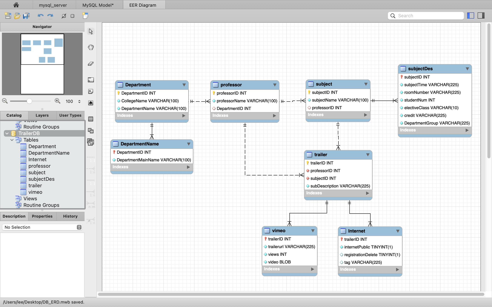

# :star2: DB Modeling :star2:

- Assignments
  | week | Assignments |
  | :-----------------------------------------------: | :--------------------------: |
  | 2 | DB Modeling |

- result
  

- Reference
  - [2022 SME SW Bootcamp](https://github.com/TEAMLAB-Lecture/sme-swbootcamp-hw-repository)
  - [프로그램](https://blissray.notion.site/SME-SW-Bootcamp-1f9f6bfffb5b40699ef8168f49ae101c)
  - [Additional Web Projects](https://github.com/Chaewon-Leee/TIL/tree/main/WEB/SME_SW_Bootcamp)
