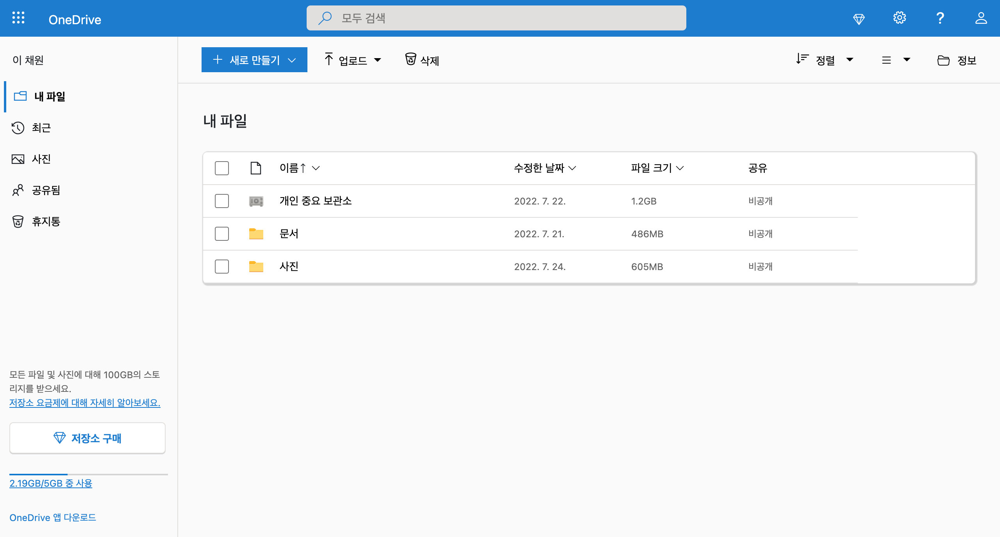

# :star2: onedrive :star2:

- 결과 확인 방법

  - HTML을 브라우저에서 실행하여 확인
  - VScode : onedrive.html 파일 - 실행(디버깅 없이 실행) - 웹앱(Chrome) 선택

- ### result

  

- ### 회고

  |   problem   |           내용            |                                                                                                                해결방안                                                                                                                 |
  | :---------: | :-----------------------: | :-------------------------------------------------------------------------------------------------------------------------------------------------------------------------------------------------------------------------------------: |
  | 네비바 구현 | 검색창 background 색 변화 | - 마우스오버랑 포커스 이벤트랑 겹치는 것 같은데, bind랑 stopimme..메소드 등 다 써봐도 대체 해결이 안 됨 <\br> 결국 아이콘을 input 박스 안에 넣어서 아이콘의 백그라운드 색상 = 인풋 박스 색상과 동일시 하게 하고 focus, hover css로 해결 |

  <네비바 구현>

- ❕검색창 background 색 변화
  > > 마우스오버랑 포커스 이벤트랑 겹치는 것 같은데, bind랑 stopimme..메소드 등 다 써봐도 대체 해결하는 방법을 모르겠다.
  > > 결국 아이콘을 input 박스 안에 넣어서 아이콘의 백그라운드 색상 = 인풋 박스 색상과 동일시 하게 하고 focus, hover css로 해결!! ㅠㅠ 이게 제일 깔끔한 방법인 것 같다
- ❕검색바는 expand-md일 때, 환경설정과 도움말은 expand-lg일 때 아이콘으로 묶인.. 드롭박스 형태로 바뀌는 것 같은데 어떻게 해결하는지 모르겠다
  > > 부트스트랩 말고 직접 코드를 짜는 게 더 쉬울수도..
- ❕div로 묶어줬음에도 불구하고 창을 줄였을 때, 아이콘들끼리 충돌나고 삐쭉뺴쭉 나오기 시작함..
  > > flexbox 속성을 새로 지정해줬다 아마 기존의 container-fluid css 안 flexbox 속성은 display:flex;외에도 다른 css 효과가 있어서 그것들과 충돌나서 그런 것 같다고 예상 -> 그래서 container-fluid를 지우고 새로 class 이름을 부여한 flexbox를 지정해줬더니 해결
- ❕검색바 크기도 줄어드는거 어떻게 하지
  > > max-width:100%로 하면 된다는데.. width:100%는 꽉 채워지게 나오는데 max-를 붙이는 순간 갑자기 크기가 줄어든다.. 왜일까?
  > > 결국 flex: none처럼 직접 지정해줘서 반응형 네비바는 성공했으나 검색바 크기가 줄어들지 않고 해당 크기는 유지된 상태로 레이아웃만 줄어든다... 어떻게 해결해야하지?
  > > 절댓값이 주어지지 않아서 바로 부모였던 form 크기에 맞추어져서 크기가 정해졌던 것 같다 vw 속성을 추가해주니 기준치가 정해졌는지 별 이상없이 작동함!!!
- ❕아이콘들 창 크기에 딱 맞춰 시작하기
  > > 결국 margin으로 해결했는데... 이걸 위치를 조정해서 하는 방법이 존재했던 걸로 기억...
  > > 뭐였는지 기억이 안남 position 중에 있던 것 같은데..
- ❔검색창 아이콘 넣기

  > > position: absolute; 차이로 인해서 어찌어찌 넣는 건 성공했는데 아직까지 정확히 왜 성공했는지는 감이 오질 않는다...
  > > 따로 공부할 필요가 있음 +width 100%

- ❓메뉴바 눌렀을 때 뭐 되는거

- 새로운 창은 아니고 뭔가 뜨는데.... 어떻게 해야하지? >> 아마 부트스트랩 : 오프캔버스 인 것 같다

<사이드바 구현>

- ❕구역 나누기
  > > 일단 flex:none; 그것들 이용해서 했지만... 제대로 될지는 모르겠따.
- ❕반응형 구현 (사이드바도 중간에 드롭박스로 묶임 + 고정되어있는 너비)
- ❕고정된 위치
  > > 네비바랑 같이 스크롤을 내려도 메인 콘텐츠만 스크롤이 생기고 나머진 그대로 위치 고정. 이런 경우... 어떻게 해결해야하지?
  > > 포기 ㅠ
- ❕창크기에 맞추기
  > > 자꾸 내부 컨텐츠에 크기가 늘어났다가 해서 position: absolute;를 해주니 창에서 컨텐츠를 제외한 크기에 아닌 정말 창 크기 (1024\*)만큼 더 증가하게 됨...
  > > clac() 이용!!

<메인>

- 구역 나누기
- ❓반응형 구현 : 업로드랑 새로 만들기 또 없어진다..ㅋㅋ
- ❓파일 추가 생성
- 파일 부분 얘는 또 반응형이 아님. ㅋㅋ 환장하겄네
